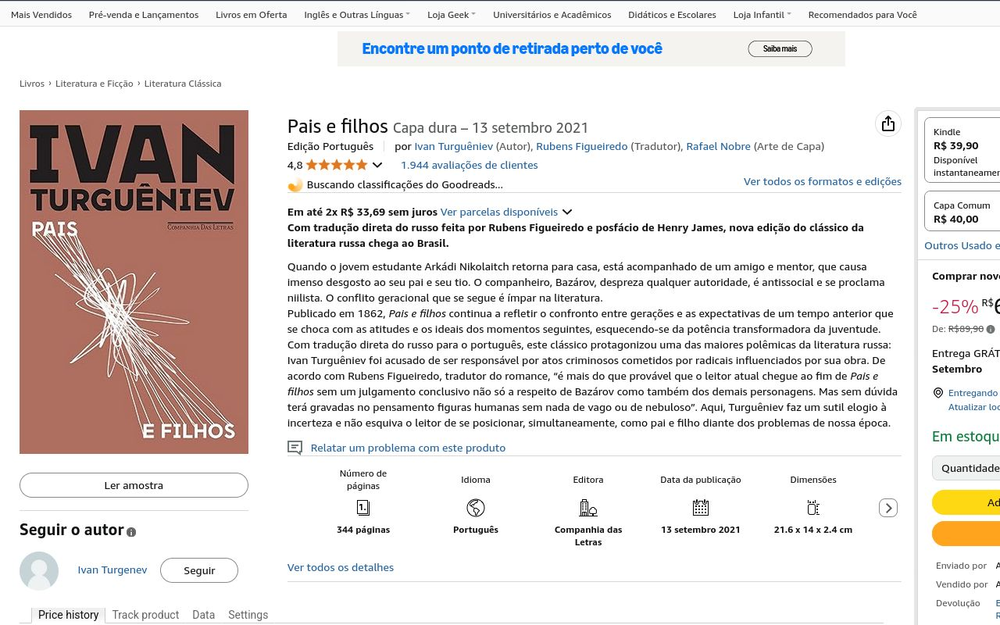
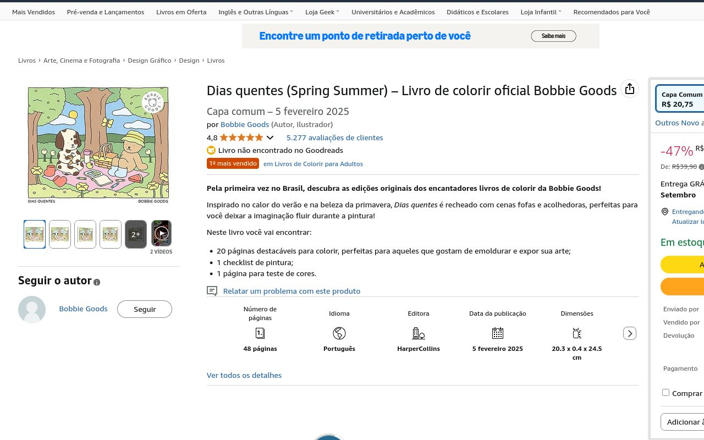

# Notas Literárias

**Languages:** [Português](README.md) | [English](README.en.md)

A browser extension that displays Goodreads ratings and reviews when you're
browsing books on Amazon Brazil, helping you make more informed purchasing
decisions.

> **Main Repository**: This project is hosted on
> [Codeberg](https://codeberg.org/leakedmemory/notas-literarias). The GitHub and
> GitLab versions are just mirrors for greater accessibility.

## Features

- **Automatic detection**: Automatically identifies book pages on Amazon Brazil
- **Goodreads ratings**: Shows average rating, number of reviews, and star
  distribution
- **Direct link**: Quick access to the complete book page on Goodreads
- **Cross-browser**: Works on Firefox and Chromium-based browsers (Chrome, Edge,
  Opera)
- **Multiple format support**: ISBN-13 and Amazon ASIN codes
- **Clean interface**: Discrete design that integrates naturally with Amazon's
  page

## Installation

### Extension Store (Recommended)

The easiest way to install is through your browser's official extension store:

_Store links will be added here_

### Manual Installation

If you prefer to install manually or the extension is not yet available in the
store:

#### Firefox

1. Download the signed `.xpi` file from the releases page
2. Open Firefox and go to `about:addons`
3. Click the gear icon and select "Install Add-on From File..."
4. Select the downloaded file

#### Chrome/Chromium/Edge

1. Download the `.zip` file from the releases page
2. Extract the ZIP file
3. Open `chrome://extensions/` (or `edge://extensions/`)
4. Enable "Developer mode"
5. Click "Load unpacked" and select the extracted folder

## How to Use

1. **Browse normally** on Amazon Brazil
2. **Enter a book page**
3. **A spinner will appear** while the extension collects information
4. **See Goodreads ratings** appear next to the product details

The extension works automatically --- no additional configuration needed!

## Demo

### During loading

 _The extension shows a spinner while
fetching information from Goodreads_

### Book found

 _Goodreads ratings displayed next to the
product details on Amazon_

### Book not found

 _Message displayed when the book is
not found in the Goodreads database_

## Frequently Asked Questions (FAQ)

### **Which sites does the extension work on?**

Only on Amazon Brazil and does not interfere with other sites.

### **Why don't some pages show ratings?**

Most of the time it's because the product is not a book. If it is a book and the
extension can't get Goodreads ratings, it may be due to the following reasons:

- The book doesn't exist in Goodreads database
- Temporary connection problems with Goodreads
- Extension bug that can be reported in Issues

### **Does the extension collect my personal data?**

No. The extension only:

- Reads information from the Amazon page (title, ISBN, ASIN)
- Queries Goodreads data by reading the book page information (doesn't use API
  directly)
- Doesn't store or send personal information

### **Why do I need permissions for Goodreads?**

The extension needs to access Goodreads to fetch book ratings. All queries are
made anonymously using only ISBN or ASIN codes.

### **Does the extension work in incognito/private mode?**

Yes, but you may need to enable this option in your browser's extension
settings.

## Amazon Brazil Focus

**Why only Amazon Brazil?** This extension is specifically designed for Amazon
Brazil (`amazon.com.br`) because different Amazon sites have different layouts,
product structures, and regional content. Each Amazon region would require
separate implementation and testing.

However, **I'm open to expanding support!** If you're interested in support for
other Amazon regions (US, UK, DE, etc.), please feel free to reach out at
`leaked.memory+notasliterarias@pm.me`. I'd be happy to discuss collaboration or
provide guidance for adapting the extension to other regions.

## Build

### Prerequisites

- **Node.js** LTS or newer
- **pnpm** 10.15+

### Environment Setup

```bash
# Clone the repository
git clone https://codeberg.org/leakedmemory/notas-literarias.git
cd notas-literarias

# Install dependencies
pnpm install
```

### Build Commands

```bash
# Build for Firefox and Chromium
pnpm build

# Build for Firefox only
pnpm build:firefox

# Build for Chromium only
pnpm build:chromium

# Create distributable packages (.xpi for Firefox, .zip for Chromium)
pnpm pack
```

### Build Structure

Build files are generated in:

- `dist/prod/firefox/` - Firefox build
- `dist/prod/chromium/` - Chromium build
- `dist/prod/*.xpi` - Firefox package (after `pnpm pack`)
- `dist/prod/*.zip` - Chromium package (after `pnpm pack`)

## Issues and Suggestions

Found a bug or have an idea to improve the extension?

1. Check if a similar issue doesn't already exist
2. Create a new issue using our templates:
   - **Bug Report** for problems
   - **Feature Request** for improvement suggestions

## Contributions

Want to contribute to the project? That's great!

Read our [contribution guide](./CONTRIBUTING.md) to learn how to:

- Set up the development environment
- Understand the code structure
- Submit pull requests
- Follow our code standards

## License

This project is licensed under the [MIT License](./LICENSE).

---

**Legal Notice**: This project is not affiliated with Amazon or Goodreads. It's
an independent project created to improve the book purchasing experience.
